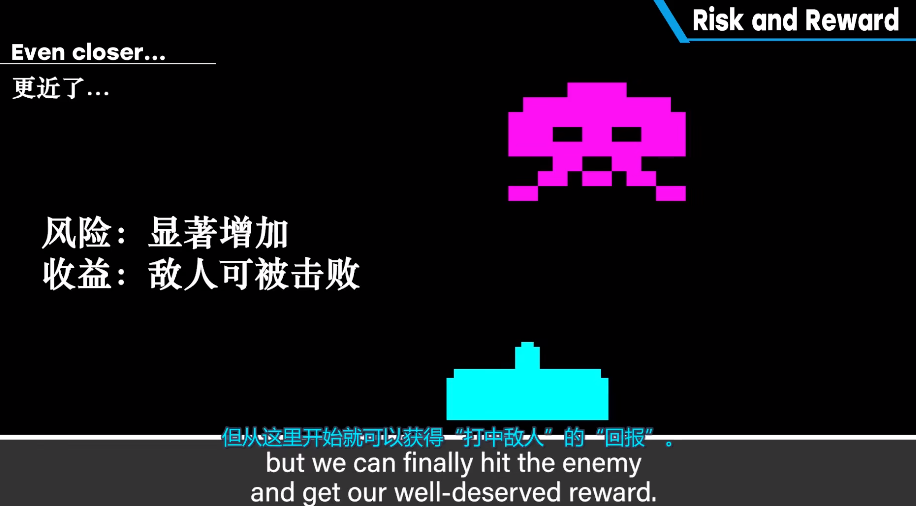

<!--more-->

# 风险理论

1、风险

2、策略

游戏性是控制风险并获得回报的乐趣

而策略是控制风险并获得回报的方法

控制并降低风险，从而更容易获得回报，即为**策略**

**风险控制**

控制游戏风险即是控制了游戏平衡

（1）底层设计：

1、自机宽度（被攻击的可能性）

2、掩体设计（增加安全区域）

玩家决策：

导致追击收益＜迎击。

如果为自机增加三叉光束，则会导致风险降低同时回报增加，玩家可以一直处于无风险的位置获得收益。

在此基础上，也可以增加新的限制，比如自机移动速度、弹药数、敌机也可发射三叉或斜方向子弹。

3、死亡之墙（名古屋击流）

风险和回报都处于最大的状态

# 压力施加和释放

施加压力：妨碍玩家进程——放置杂兵、设置障碍或揭秘要素

释放压力：奖励玩家，为他们提供更有效处理压力要素的手段
